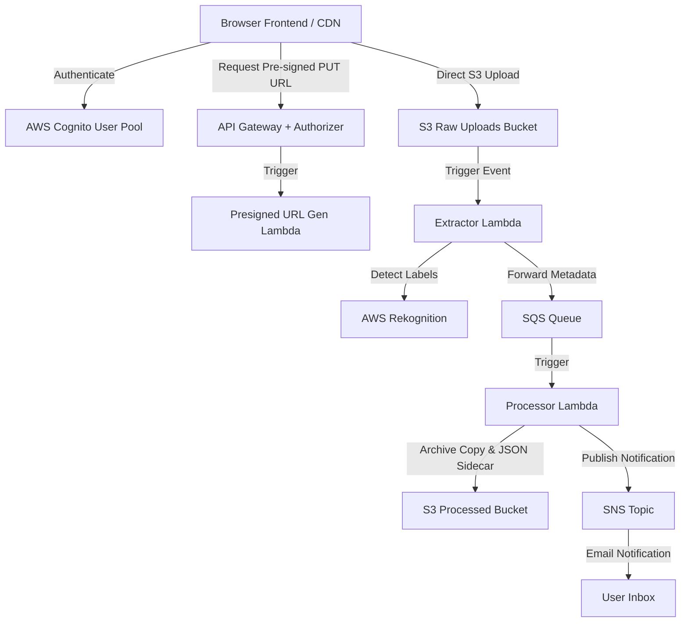

# Image Processing System: AI-Powered Image Processing Pipeline & Dashboard

This is a secure, serverless image processing application built on AWS that leverages artificial intelligence to analyze uploaded images, archive metadata sidecars, and notify users via automated emails. 

---

## 🏢 Architecture & Components

The application is built on a fully decoupled serverless infrastructure orchestrated using **Terraform**:



### 1. Frontend Web App
- **Static Hosting**: Served globally via an **AWS CloudFront CDN** backed by a private S3 hosting bucket with Origin Access Control (OAC).
- **Authentication**: Integrates directly with an **AWS Cognito User Pool** utilizing custom attributes (`custom:role` set to "Intern").
- **Session Persistence**: Stores Cognito tokens in `localStorage` upon login, ensuring sessions persist across page refreshes.
- **Client Storage (IndexedDB)**: To keep page load speeds fast without hitting browser local storage limit quotas, high-resolution original images are stored in a client-side **IndexedDB** database (`ImageProcessingDB`). A small 80px canvas thumbnail is kept in `localStorage` for rendering the recent uploads list.
- **Details Modal**: Clicking **View** on a history item pulls the original image from IndexedDB and displays the full-quality preview modal alongside file metadata (name, size, timestamp).

### 2. AWS Lambda Pipeline Backend
- **Pre-signed URL Generator**: Authenticates Cognito tokens and generates a secure S3 pre-signed `PUT` URL for client uploads, ensuring the raw S3 bucket remains strictly private.
- **Extractor Lambda**: Triggered when a new file lands in S3. It extracts the uploader's email from the S3 metadata headers, fetches object details (file size and upload timestamp) via `head_object`, calls **AWS Rekognition** to detect labels, and forwards this data to an SQS Queue.
- **Processor Lambda**: Triggered by SQS message polling. It copies the raw image to a processed bucket, generates a sidecar metadata JSON file (`{filename}-analysis.json`), and publishes a completion event to an SNS topic.
- **SNS Notifications**: Emails completion alerts containing **Image Details** (File Name, File Size, Upload Time) and **AI Rekognition Labels** to all subscribed emails.

---

## ✨ Features Built

- **Stateless Session Persistence**: The login session is retained across browser refreshes and tab closures until a manual **Logout** is clicked.
- **High-Quality Previews**: IndexedDB integration ensures that detail preview images are shown in full-resolution rather than being compressed or blurry.
- **Enriched Emails**: Emailed reports contain the image's original file name, calculated size (KB/MB formatting), upload time in UTC, and labels detected with confidence percentages.
- **Progress Tracking**: Shows interactive progression checkpoints during uploads:
  1. *Cognito JWT Token Authorized*
  2. *Requesting S3 Pre-signed URL...*
  3. *Uploading Image to S3...*
  4. *Queueing SQS processing & AI labeling...*
  5. *Success! Check your email for AI analysis.*
- **Hidden JWT tokens**: Internal authentication details are kept strictly in memory for security rather than being printed to the user dashboard.

---

## 🚀 How to Run & Deploy

### Prerequisites
1. Installed **AWS CLI** and configured with active developer credentials.
2. Installed **Terraform** CLI.

### Steps to Deploy
1. **Initialize Terraform**:
   ```bash
   terraform init
   ```
2. **Apply Configurations**:
   ```bash
   terraform apply -auto-approve
   ```
   *This command will bundle the lambda python source code into zip archives and build all resources in AWS.*
3. **Purge CDN Cache**:
   After modifying static templates, invalidate CloudFront CDN cache to deploy changes instantly:
   ```bash
   aws cloudfront create-invalidation --distribution-id <CF_DISTRIBUTION_ID> --paths "/*"
   ```

---

## 📂 Project Structure

```text
Image Uploads/
├── lambda/
│   ├── extractor.py    # Fetches object data & Rekognition labels
│   ├── presigned.py    # Generates secure PUT URLs for uploads
│   └── processor.py    # Saves processed metadata & publishes SNS emails
├── main.tf             # Core AWS Terraform resource configurations
├── variables.tf        # Input variable definitions (region, emails)
├── outputs.tf          # Stack output definitions (CDN URL, S3 Buckets)
├── index.html.tftpl    # Frontend index template (used by Terraform)
├── index.html          # Frontend index static copy
└── README.md           # Project documentation
```
